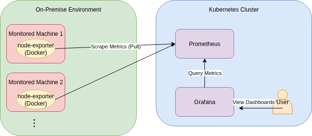

# onprem-k8s-monitoring

オンプレミス環境で稼働している複数のマシンを、Kubernetesクラスターに含めずにGrafanaとPrometheusを用いて監視するツールです。

## 概要

本リポジトリでは、以下の特徴を持つ監視環境を構築します。

- 監視対象のマシンにDockerで`node-exporter`をデプロイし、マシンのメトリクスを収集します。
- Kubernetesクラスタ上に`Prometheus`をデプロイし、各マシンの`node-exporter`からメトリクスを収集・保存します。
- Kubernetesクラスタ上に`Grafana`をデプロイし、`Prometheus`が収集したメトリクスを可視化します。
- 監視対象のマシンは、Kubernetesクラスタのノードである必要はありません。



## ディレクトリ構成

```
.
├── helm-charts/
│   └── prometheus-custom/ # Prometheusをデプロイするための自作Helmチャート
├── helmfiles/
│   └── grafana/           # GrafanaをデプロイするためのHelmfile
└── node-exporter/
    └── docker-compose.yml # 各マシンにデプロイするnode-exporterのDocker Composeファイル
```

## 事前準備

- **監視対象マシン**:
  - DockerおよびDocker Composeがインストールされていること
- **Kubernetesクラスタ**:
  - `node-exporter`をデプロイした各マシンにネットワーク的にアクセス可能であること
  - Helmが利用可能であること
  - Helmfileが利用可能であること

## 構築手順

### 1. Node Exporterのデプロイ

監視したい各マシン上で、`node-exporter`コンテナを起動します。

1.  本リポジトリの`node-exporter/`ディレクトリを監視対象のマシンにコピーします。

2.  `node-exporter`のバージョンなどを環境変数で設定します。設定方法は以下のいずれかを選択してください。

    *   **.envファイルを使用する方法**

        `.env.example` をコピーして `.env` ファイルを作成し、ファイル内の変数を編集します。

        ```bash
        cp .env.example .env
        # .env ファイルを編集
        ```

    *   **コマンド実行時に環境変数を設定する方法**

        `docker-compose`コマンドの前に環境変数を指定します。

        ```bash
        export NODE_EXPORTER_VERSION=v1.10.2
        ```

3.  以下のコマンドを実行して`node-exporter`を起動します。

    ```bash
    docker-compose up -d
    ```

### 2. Prometheusのデプロイ

Kubernetesクラスタ上にPrometheusをデプロイします。

1.  **作業ディレクトリに移動します。**

    まず、PrometheusのHelmチャートが格納されているディレクトリに移動します。以降の作業はこのディレクトリで行います。

    ```bash
    cd helm-charts/prometheus-custom
    ```

2.  **`node_exporter` の監視ターゲットを設定します。**

    Prometheusがメトリクスを収集する対象（`node_exporter`が稼働しているマシン）のIPアドレスとポートのリストを `values.yaml` の `configmap.scrape_configs` に設定する必要があります。
    この設定は、リポジトリ内の `values.yaml` を直接編集するのではなく、独自のValuesファイルを作成して管理してください。設定方法は主に以下の2通りです。

    *   **方法A: 新しいValuesファイルを作成して指定する**

        `values.yaml` をコピーして `values-local.yaml` のような新しいファイルを作成し、`configmap.scrape_configs` 内の `targets` をご自身の環境に合わせて編集します。

        **`values-local.yaml` の編集例:**
        ```yaml
        # ... (他の設定は省略) ...
        configmap:
          # ...
          scrape_configs:
            - job_name: 'prometheus'
              static_configs:
                - targets: ['localhost:9090']
            - job_name: 'node_exporters'
              static_configs:
                - targets:
                    - '192.168.1.1:9100' # マシン1
                    - '192.168.1.2:9100' # マシン2
                    # ... 監視したいマシンを追記 ...
        ```

    *   **方法B: `targets` のリストを別ファイルで指定する**

        監視ターゲットのリストのみを記述したYAMLファイル（例: `targets.yaml`）を作成します。

        **`targets.yaml` の例:**
        ```yaml
        - '192.168.1.1:9100'
        - '192.168.1.2:9100'
        ```
        この方法では、後述する `helm install` コマンドで `--set-file` フラグを使い、`values.yaml` の特定のキーをこのファイルの内容で上書きします。

3.  **Prometheusをデプロイします。**

    以下のコマンドを実行して、Prometheusをデプロイします。

    *   **方法Aの場合:**
        ```bash
        helm install prometheus . \
          --namespace monitoring \
          --create-namespace \
          -f values-local.yaml
        ```

    *   **方法Bの場合:**
        ```bash
        helm install prometheus . \
          --namespace monitoring \
          --create-namespace \
          --set-file configmap.scrape_configs[1].static_configs[0].targets=targets.yaml
        ```


### 3. Grafanaのデプロイ

Kubernetesクラスタ上にGrafanaをデプロイします。

1.  **作業ディレクトリに移動します。**

    まず、GrafanaのHelmfileが格納されているディレクトリに移動します。以降の作業はこのディレクトリで行います。

    ```bash
    cd helmfiles
    ```

2.  **設定ファイルを準備します。**

    `helmfile`およびGrafana Helmチャート用の設定ファイルを、サンプルをコピーして作成します。

    *   **Helmfile用の変数ファイル:**
        `vars/grafana.yaml.example` を `vars/grafana.yaml` という名前でコピーし、ご自身の環境に合わせて内容を編集します。

    *   **Grafanaチャート用のValuesファイル:**
        `values/grafana.yaml.example` を `values/grafana.yaml` という名前でコピーし、Grafanaに設定したい値を編集します。

3.  **Grafanaをデプロイします。**

    以下のコマンドを実行して、Grafanaをデプロイします。

    ```bash
    helmfile apply .
    ```

以上で構築は完了です。Grafanaにアクセスし、データソースとしてPrometheusを指定することで、各マシンのメトリクスを可視化できます。

## Grafana WebUI へのアクセス方法

GrafanaのWeb UIにアクセスするには、`helmfiles/values/grafana.yaml`ファイルで外部アクセスの方法（`NodePort`または`Ingress`）を設定する必要があります。
もしくは、`kubectl port-forward`コマンドを利用して、ローカルマシンから一時的にアクセスすることも可能です。

### 方法1: NodePortを利用する

`helmfiles/values/grafana.yaml`で`service.type`を`NodePort`に設定します。

```yaml
# helmfiles/values/grafana.yaml
service:
  type: NodePort
```

デプロイ後、以下のURLにアクセスします。
`http://<KubernetesクラスタのいずれかのノードのIPアドレス>:<NodePort>`

### 方法2: Ingressを利用する

Ingress Controllerがクラスターにインストールされている場合、`helmfiles/values/grafana.yaml`でIngressを有効にします。

```yaml
# helmfiles/values/grafana.yaml
ingress:
  enabled: true
  ingressClassName: nginx # ご利用のIngress Controllerに合わせて変更
  hosts:
    - grafana.local # アクセスするためのホスト名
```

デプロイ後、以下のURLにアクセスします。
`http://grafana.local`

### 方法3: kubectl port-forwardを利用する

`NodePort`や`Ingress`を設定せずに、ローカルマシンから一時的にアクセスする場合に利用します。

1.  以下のコマンドを実行して、ポートフォワードを開始します。

    ```bash
    kubectl port-forward -n monitoring svc/grafana 3000:80
    ```

2.  ブラウザで `http://localhost:3000` にアクセスします。

### ログイン情報

上記いずれかの方法でアクセスした後、ログイン画面が表示されます。
ユーザー名とパスワードは、GrafanaのSecretリソースに格納されており、それぞれ以下のコマンドで確認できます。

*   **ユーザー名**

    ```bash
    kubectl get secret -n monitoring grafana -o jsonpath="{.data.admin-user}" | base64 -d
    ```

*   **パスワード**

    ```bash
    kubectl get secret -n monitoring grafana -o jsonpath="{.data.admin-password}" | base64 -d
    ```
